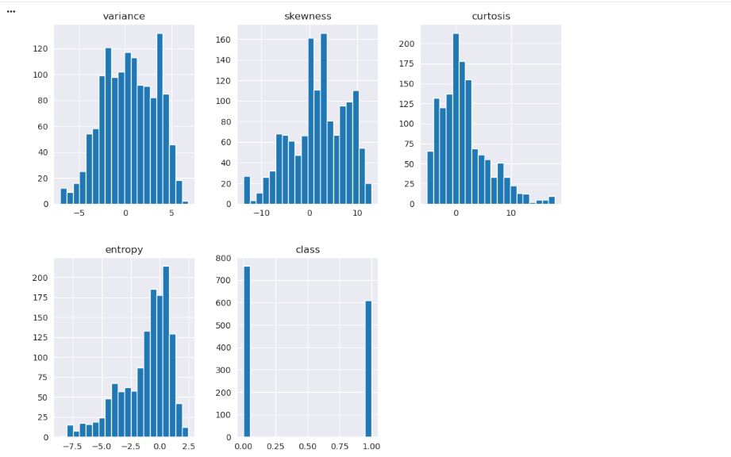
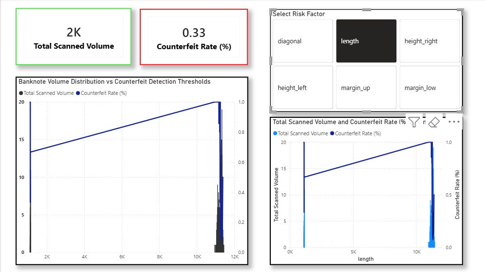
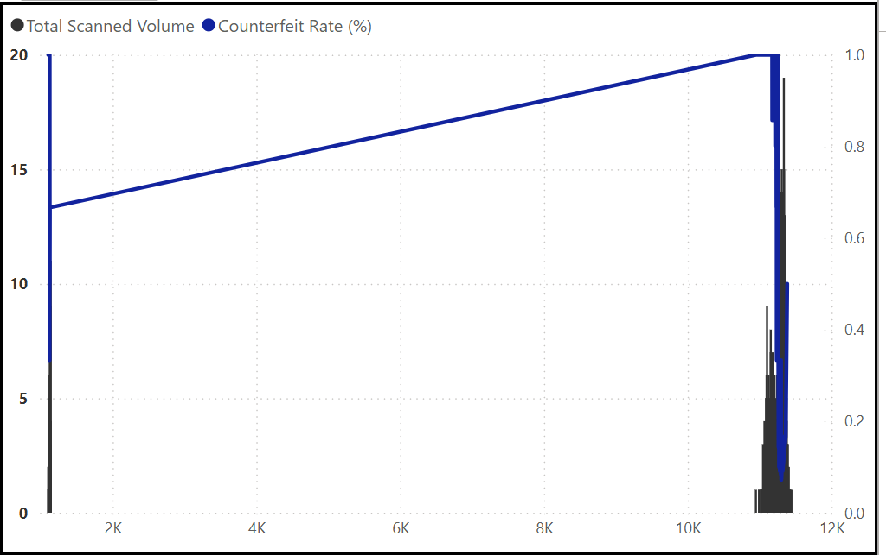

# Bank-Note-Authentication
End-to-end currency forensics pipeline combining an optimized Random Forest classifier with an interactive Power BI dashboard to detect counterfeit banknotes with geometric precision.

# Banknote Authentication & Risk Analysis Dashboard

An end-to-end data analytics and machine learning project designed to identify counterfeit banknotes using physical geometric dimensions. This project combines a **Random Forest Classifier** predictive pipeline with an interactive **Power BI Dashboard** for proactive risk analysis and structural pattern discovery.

### Report 1: Python Exploratory Data Analysis (EDA) Overview
Comprehensive exploratory Variate, Correlation, matrix tracking how much it affects the notes result with python.
 


### Report 2: Banknote Authentication Dashboard Overview
Full operational fraud monitoring canvas displaying total scanned volumes, counterfeit rates, and dual-axis parameter distributions.


### Report 3: Physical Parameter Cross-Filtering Analysis
Granular breakdown tracking length variations and identifying strategic counterfeit detection rates using dynamic parameter selections.


### Report 4: Low Margin Specific Structural Deep-Dive
Macro view tracking localized physical margin variances and high-risk threshold patterns across scanned banknote dimensions.


### Report 5: Isolated Feature Tracking & Volume Distribution
Strategic single-variable performance tracking focused purely on volume thresholds and baseline distribution trends.



## Project Overview
Counterfeit currency poses an ongoing threat to financial operations. This project establishes a data-driven approach to:
1. **Predict:** Automatically classify whether a banknote is genuine or counterfeit based on structural measurements.
2. **Analyze:** Drill down into geometric risk factors (e.g., margins, length, diagonal dimensions) that correlate most heavily with fraudulent anomalies.

---

## Repository Structure
*   `fake_bills.csv` - Raw dataset containing physical measurements of 1,500 banknotes.
*   `Clean_Treasury_Bills.csv` - Cleaned dataset with class-specific dynamic median imputation, optimized for BI reporting.
*   `bank_note_authen_with_randomforest_classifier.ipynb` - Jupyter Notebook containing data exploration, preprocessing, and the Random Forest training workflow.
*   `Bank Note Visualization.pbix` - Power BI Desktop file containing the interactive risk analysis dashboard.

---

## Data Pipeline & Preprocessing
The raw dataset contains **37 missing values** strictly localized within the `margin_low` feature column. To preserve statistical integrity and distinct structural profiles:
*   **Dynamic Class Imputation:** Missing values were filled using the **median of their respective authenticity class** (Genuine vs. Counterfeit) rather than a naive global average.
*   **Label Mapping:** The target variable `is_genuine` (True/False) was refactored into descriptive categories (`Genuine` / `Counterfeit`) to streamline reporting schemas within Power BI.

### Banknote Features Included:
*   `diagonal` (mm)
*   `height_left` & `height_right` (mm)
*   `margin_up` & `margin_low` (mm)
*   `length` (mm)

---

## Predictive Modeling
The machine learning pipeline utilizes a **Random Forest Classifier** implemented via `scikit-learn` to handle non-linear decision boundaries among physical dimensions. 

*   **Libraries Used:** `pandas`, `numpy`, `scikit-learn`, `matplotlib`, `seaborn`
*   **Validation Strategy:** Train-Test Split validation to ensure generalized performance against out-of-sample data points.

## Project Previews

### Python Exploratory Data Analysis
Below are the data distribution, feature interaction, and correlation visualizations generated during the initial exploration phase within the Jupyter Notebook:

```markdown
<!-- Python Preview Gallery -->
<p align="center">
  
  
  
</p>


### Key Analytics Features:
*   **High-Level KPIs:** Instant visibility into **Total Scanned Volume** and the **Counterfeit Rate (%)**.
*   **Dynamic Feature Slicing:** Interactive parameter toggles allowing investigators to switch between different physical attributes (`length`, `margin_up`, `diagonal`, etc.) on the fly.
*   **Volume & Risk Distributions:** Dual-axis charts highlighting where high-density scan zones overlap with elevated counterfeit detection spikes.


